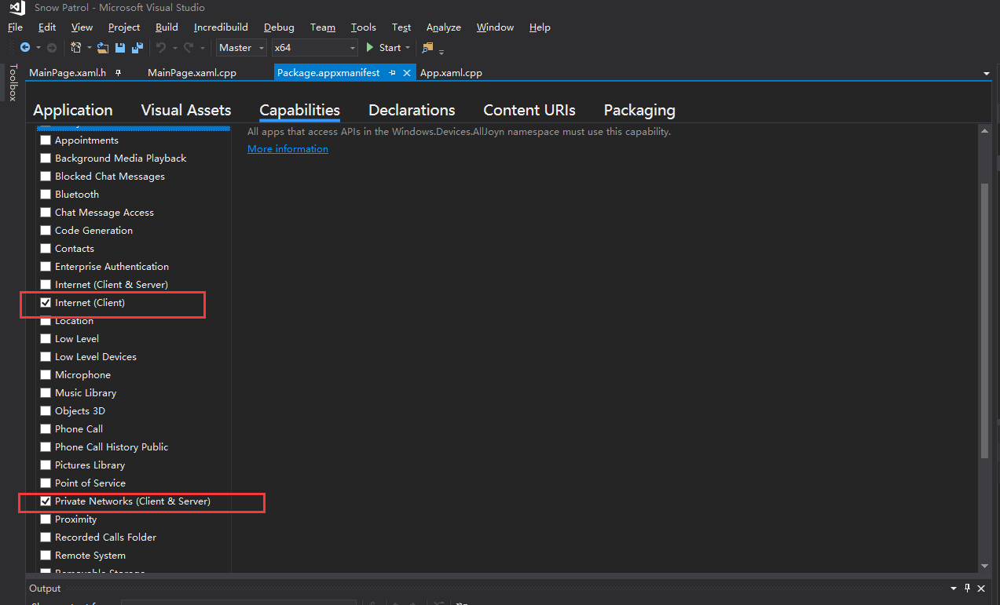

# Miracle Games UWP SDK

**Other language versions: [English](sdk_uwp.en.md), [中文](sdk_uwp.zh-CN.md).**

**SDK Name:** Miracle Games UWP SDK

**Company Name of SDK Provider:** Beijing Qiyou Lingdong Technology Co., Ltd.

**Types of Personal Information Processed:** Data actively uploaded by you, device information (device model, operating system version number), network information (network type), application information.

**Purpose of Use and Functional Scenarios:** Provides login, payment, and other related functions.

**SDK Privacy Policy:** [Miracle Games Privacy Policy](https://www.mguwp.net/developer_privacy.html)

**Processing Method:** 1. Ensures security through SSL protocol encryption and HTTPS transmission encryption technology; 2. Processes data with de-identification measures such as encryption and anonymization.

**Compliance Usage Instructions:** [Miracle Games SDK Compliance Usage Guide](https://www.mguwp.net/developer_compliance.html)

---
# Integration and Function Description
### [1. Development Environment Configuration](#1-development-environment-configuration)
### [2. SDK Initialization](#2sdk-initialization)
### [3. Advertisements](#3advertisements)
### [Contact Information](#contact-information-1)
---


# 1. Development Environment Configuration

### 1.1. Package.appxmanifest Settings

You need to ensure the following permissions:

*   Internet (Client)
    
*   Private Networks (Client & Server)

Double-click to open Package.appxmanifest, and click on "Capabilities":


# 2.SDK Initialization

### 2.1.Introduction

      Before integrating the Miracle Games SDK, you need to initialize the SDK first. Only after initialization is completed can you use all the features of this SDK in conjunction with the backend system. SDK initialization should be performed when the game starts.


### 2.2.SDK Initialization

```c#
using MiracleGamesAd;
using MiracleGamesAd.Models;

private async void MainPage_Loaded(object sender, RoutedEventArgs e)
{
    // Initialization interface call. Required parameters are applied for and created in the MG Ads backend.
    var result = await ApplicationManager.Initialize("YOUR_APP_KEY", "YOUR_Secret_Key");
    if (result.ReturnValue) // Initialization callback interface to check if initialization is complete.
    {
  
    }
}
```

### 2.3.Possible reasons for initialization failure include:

　　● Network failure, no proper network connection

　　● This SDK does not support VPN; VPN software is enabled on the device

　　● Incorrect AppId, please check your application settings in the developer backend

　　● Server issues, please check the error information in the result and [contact technical support](contact.en.md) promptly

 
# 3.Advertisements

## Introduction

Before integrating ads, the SDK initialization must be completed first.

MG Ads supports 【Splash Screen 1920*1080】【Exit Screen】【Banner 728*90】【Interstitial 1024*768】【Couplet 300*600】【Rewarded Video 1024*768】【Information flow】【Embedded】.

## Splash Screen Ad

The splash screen ad slot is typically implemented in the page's load method, within the SDK initialization completion event.

```c#
public async void FullScreenAd()//MG FullScreenAd
{
   //"XXXXXXXX" parameter needs to be passed with the ad key, which comes from the MG ad backend.
   var ad = await AdvertisingManager.ShowAd("XXXXXXXX", AdType.FullScreen);
   if (ad.ReturnValue)//Triggers ad close event when ad is closed
   {
     
   }
}
```

## Exit Screen Ad

The exit screen ad is triggered when exiting the game. To ensure the pop-up rate of the ad upon game exit, MG recommends loading the exit screen ad information into memory after initialization is complete. When exiting the game, the SDK will automatically open the exit screen ad directly.

The code to load the exit screen ad is as follows:
```c#
//"XXXXXXXX" parameter needs to be passed with the ad key, which comes from the MG ad backend.
AdvertisingManager.SetupExitunitId("XXXXXXXX");
```
After integrating the exit screen ad code, the following settings are also required.

1. First, change the Target version on the Properties->Application tab of the main project to 19041 (or a higher version).

2. Right-click Package.appxmanifest and choose to open and edit it with the Xml editor.

3. In the Package tag, add xmlns:rescap="http://schemas.microsoft.com/appx/manifest/foundation/windows10/restrictedcapabilities", and supplement rescap in IgnorableNamespaces.

4. Under the Capabilities node, add this line.

5. Save.

## Banner Ad

```c#
public async void ShowBannerAdImage()
{
    var opt = new BannerAdSettingOptions();//Set some configuration parameters for the ad; defaults are used when not set.
    opt.MediaType = "image";//Set ad type: image="image", web="web".
    //Control the position where the ad is displayed.
    opt.VerticalAlignment = VerticalAlignment.Center; 
    opt.HorizontalAlignment = HorizontalAlignment.Center;
    //"XXXXXXXX" parameter needs to be passed with the ad key, which comes from the MG ad backend.
    var bannerAd = await AdvertisingManager.ShowAd("XXXXXXXX", AdType.Banner, opt);
    if (bannerAd.ReturnValue)//Triggers ad close event when ad is closed.
    {

    }
}
```

## Interstitial Ad

```c#
public async void ShowInterstitialAdDefault()
{
    var opt = new InterstitialAdSettingOptions();//Set some configuration parameters for the ad; defaults are used when not set.
    opt.MediaType = "image";//Set ad type: image="image", web="web", video="video".
    //"XXXXXXXX" parameter needs to be passed with the ad key, which comes from the MG ad backend.
    var interstitialAd = await AdvertisingManager.ShowAd("XXXXXXXX", AdType.Interstitial,opt);
    if (interstitialAd.ReturnValue)//Triggers ad close event when ad is closed.
    {

    }
}
```

## Couplet Ad

```c#
public async void ShowCoupletAdDefault()
{
    var opt = new CoupletAdSettingOptions();//Set some configuration parameters for the ad; defaults are used when not set.
    opt.MediaType = "image";//Set ad type: image="image", web="web".
    //"XXXXXXXX" parameter needs to be passed with the ad key, which comes from the MG ad backend.
    var coupletAd = await AdvertisingManager.ShowAd("XXXXXXXX", AdType.Couplet,opt);
    if (coupletAd.ReturnValue)//Triggers ad close event when ad is closed.
    {

    }
}
```

## Rewarded Video

```c#
public async void ShowRewardAd()
{
    var json = "{\"coin\":100}";
    var rewardAd = await AdvertisingManager.ShowAd(RewardAdUnitId,
        AdType.Reward,
        new RewardAdSettingOptions
        {
            MediaType = "video",//Set ad type: image="image", web="web", video="video".
            Comment = WebUtility.UrlEncode(json),//Developer-defined parameter.
            CallbackId = ""//Callback address, can be empty.
        });
    if (rewardAd.Tag is RewardAdCompleteState completeState)
    {
        if (completeState.IsCompleted)
        {
            //Game logic issues reward, then report fulfillment.
            var comment = WebUtility.UrlDecode(completeState.Comment);
            await AdvertisingManager.ReportAdRewardFulfillment(completeState.RewardId);
        }
    }
}
```

## Information Flow

Information flow ads require the developer to create and maintain the control, and pass the control instance to the SDK.

```c#
public async void ShowFeedAdDefault()
{
    //Supported developer control types that can be passed are Panel, ContentControl, UserControl, and their derived classes.
    var feedAdSettingOptions = new FeedAdSettingOptions
    {
        Container = FeedContainer
    };
    //"XXXXXXXX" parameter needs to be passed with the ad key, which comes from the MG ad backend.
    var feed = await AdvertisingManager.ShowAd("XXXXXXXX", AdType.Feed, feedAdSettingOptions);
}
```

## Embedded

Embedded ads require the developer to create and maintain the control, and pass the control instance to the SDK.

```c#
public async void ShowEmbededAdDefault()
{
    //Supported developer control types that can be passed are Panel, ContentControl, UserControl, and their derived classes.
    var embededAdSettingOptions = new EmbededAdSettingOptions
    {
        Container = EmbededContainer
    };
    //"XXXXXXXX" parameter needs to be passed with the ad key, which comes from the MG ad backend.
    var embeded = await AdvertisingManager.ShowAd("XXXXXXXX", AdType.Embeded, embededAdSettingOptions);
}
```

# Contact Information

| Type              | Details                      |
|-------------------|------------------------------|
| 📞 Service Phone  | 86-010-85895781              |
| 📧 Technical Email | Technic@mguwp.com            |
| 🕒 Service Hours   | 10:00 - 19:00                |
