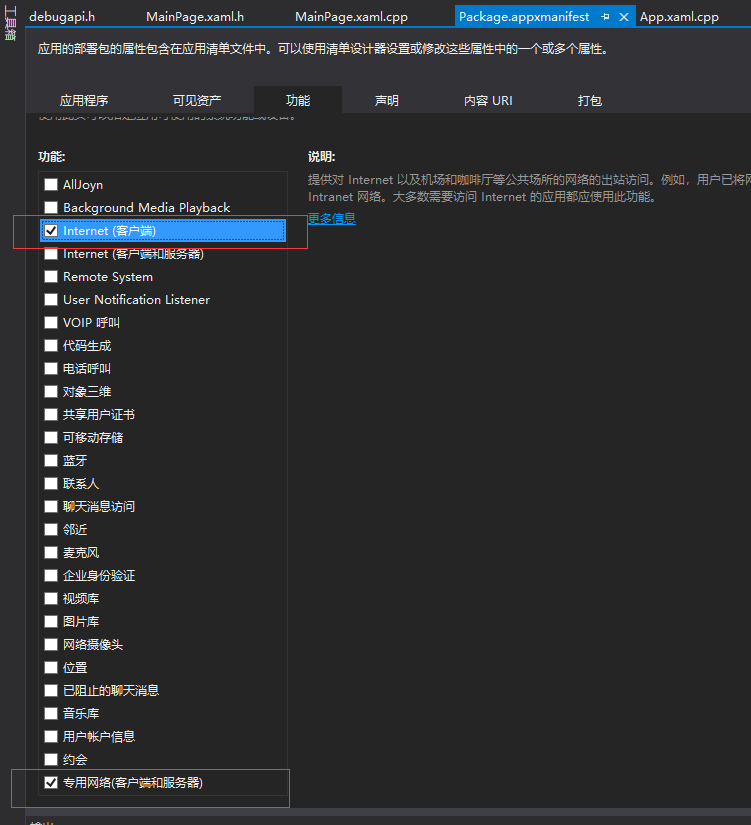

# Miracle Games UWP SDK

**其他语言版本: [English](sdk_uwp.en.md), [中文](sdk_uwp.zh-CN.md).**

**SDK名称：** Miracle Games UWP SDK

**SDK提供方的公司名称：**  北京奇游灵动科技有限公司

**处理的个人信息类型：** 您主动上传的数据、设备信息（设备型号、操作系统版本号）、网络信息（网络类型）、应用信息

**使用目的及功能场景：** 提供广告等相关功能

**SDK隐私政策：** [Miracle Games 隐私政策](https://www.mguwp.net/developer_privacy.html)

**处理方式：** 1、采用SSL协议加密及HTTPS传输加密技术保障安全； 2、采取加密、去标识化等安全措施脱敏处理

**合规使用说明：** [Miracle Games SDK 合规使用指南](https://www.mguwp.net/developer_compliance.html)

---
# 集成和功能说明
### [1.开发环境配置](#1开发环境配置-1)
### [2.SDK初始化](#2SDK初始化-1)
### [3.广告](#3广告-1)
### [联系方式](#联系方式-1)
---


# 1.开发环境配置

### 1.1.Package.appxmanifest设置

您需要保证如下权限

*   Internet（客户端）
    
*   专用网络（客户端和服务器）
    

双击打开Package.appxmanifest,点击“功能” :


# 2.SDK初始化

### 2.1.简介

      在接入MG Ads SDK之前，首先需要进行SDK的初始化，初始化完成后，才可以配合后台系统使用本SDK的全部功能，在进入游戏后立即进行SDK初始化。


### 2.2.SDK初始化

```c#
using MiracleGamesAd;
using MiracleGamesAd.Models;

private async void MainPage_Loaded(object sender, RoutedEventArgs e)
{
    //初始化接口调用，所需参数在MG广告后台申请创建
    var result = await ApplicationManager.Initialize("YOUR_APP_KEY"，"YOUR_Secret_Key");
    if (result.ReturnValue)//初始化回调接口，检测是否初始化完成。
    {
  
    }
}
```

### 2.3.没有初始化成功的错误可能如下

　　● 网络故障，没有正确的网络支持

　　● 本SDK不支持VPN，本机开启了VPN软件

　　● AppId错误，请登录开发者后台检查应用设置

　　● 服务器问题，请检查result的错误信息，及时[联系技术支持](contact.zh-CN.md)

 
# 3.广告

## 简介

      在接入广告之前，首先需要完成SDK的初始化。

      MG Ads 支持【开屏1920\*1080】【退屏】【横幅728\*90】【插屏1024\*768】【对联300\*600】【激励视频1024\*768】【信息流】【嵌入式】

## 开屏广告

开屏广告位一般在页面的load方法中，在SDK初始化完成事件中实现。

```c#
public async void FullScreenAd()//MG FullScreenAd
{
   //“XXXXXXXX”参数需要传入广告key，广告key来自MG广告后台创建。
   var ad = await AdvertisingManager.ShowAd("XXXXXXXX", AdType.FullScreen);
   if (ad.ReturnValue)//关闭广告时触发广告关闭事件
   {
     
   }
}
```

## 退屏广告

	退屏广告是在退出游戏时触发，为了保证退出游戏时广告的弹出率，MG建议在初始化完成后首先将退屏广告的信息加载到内存中，在退出游戏时，SDK会自动直接打开退屏广告

      	加载退屏广告的代码如下
```c#
//“XXXXXXXX”参数需要传入广告key，广告key来自MG广告后台创建。
AdvertisingManager.SetupExitunitId("XXXXXXXX");
```
接入退屏广告代码之后，还需要进行以下设置。

1.首先将主工程的Properties->Application页签中Target version改为19041（或者高于此版本）

2.右键Package.appxmanifest，选择Xml编辑器打开编辑

3.在Package标签中增加xmlns:rescap="http://schemas.microsoft.com/appx/manifest/foundation/windows10/restrictedcapabilities"，并在IgnorableNamespaces中补充rescap

4.在Capabilities节点下，增加这一行

5.保存即可
## 横幅广告

```c#
public async void ShowBannerAdImage()
{
    var opt = new BannerAdSettingOptions();//设置广告的一些配置参数，未设置时使用默认状态
    opt.MediaType = "image";//设置广告类型图片="image",网页="web"
    //控制展示广告的位置
    opt.VerticalAlignment = VerticalAlignment.Center; 
    opt.HorizontalAlignment = HorizontalAlignment.Center;
    //“XXXXXXXX”参数需要传入广告key，广告key来自MG广告后台创建。
    var bannerAd = await AdvertisingManager.ShowAd("XXXXXXXX", AdType.Banner, opt);
    if (bannerAd.ReturnValue)//关闭广告时触发广告关闭事件
    {

    }
}
```

## 插屏广告

```c#
public async void ShowInterstitialAdDefault()
{
    var opt = new InterstitialAdSettingOptions();//设置广告的一些配置参数，未设置时使用默认状态
    opt.MediaType = "image";//设置广告类型图片="image",网页="web",视频="video"
    //“XXXXXXXX”参数需要传入广告key，广告key来自MG广告后台创建。
    var interstitialAd = await AdvertisingManager.ShowAd("XXXXXXXX", AdType.Interstitial,opt);
    if (interstitialAd.ReturnValue)//关闭广告时触发广告关闭事件
    {

    }
}
```

## 对联广告

```c#
public async void ShowCoupletAdDefault()
{
    var opt = new CoupletAdSettingOptions();//设置广告的一些配置参数，未设置时使用默认状态
    opt.MediaType = "image";//设置广告类型图片="image",网页="web"
    //“XXXXXXXX”参数需要传入广告key，广告key来自MG广告后台创建。
    var coupletAd = await AdvertisingManager.ShowAd("XXXXXXXX", AdType.Couplet,opt);
    if (coupletAd.ReturnValue)//关闭广告时触发广告关闭事件
    {

    }
}
```

## 激励视频

```c#
public async void ShowRewardAd()
{
    var json = "{\"coin\":100}";
    var rewardAd = await AdvertisingManager.ShowAd(RewardAdUnitId,
        AdType.Reward,
        new RewardAdSettingOptions
        {
            MediaType = "video",//设置广告类型图片="image",网页="web",视频="video"
            Comment = WebUtility.UrlEncode(json),//开发者自定义参数
            CallbackId = ""//回调地址，可为空
        });
    if (rewardAd.Tag is RewardAdCompleteState completeState)
    {
        if (completeState.IsCompleted)
        {
            //游戏逻辑发奖，然后报告核销
            var comment = WebUtility.UrlDecode(completeState.Comment);
            await AdvertisingManager.ReportAdRewardFulfillment(completeState.RewardId);
        }
    }
}
```

## 信息流

信息流广告需要开发者创建并维护控件，将控件实例传给SDK。

```c#
public async void ShowFeedAdDefault()
{
    //支持传入的开发者控件类型是Panel, ContentControl, UserControl及他们的派生类
    var feedAdSettingOptions = new FeedAdSettingOptions
    {
        Container = FeedContainer
    };
    //“XXXXXXXX”参数需要传入广告key，广告key来自MG广告后台创建。
    var feed = await AdvertisingManager.ShowAd("XXXXXXXX", AdType.Feed, feedAdSettingOptions);
}
```

## 嵌入式

嵌入式广告需要开发者创建并维护控件，将控件实例传给SDK。

```c#
public async void ShowEmbededAdDefault()
{
    //支持传入的开发者控件类型是Panel, ContentControl, UserControl及他们的派生类
    var embededAdSettingOptions = new EmbededAdSettingOptions
    {
        Container = EmbededContainer
    };
    //“XXXXXXXX”参数需要传入广告key，广告key来自MG广告后台创建。
    var embeded = await AdvertisingManager.ShowAd("XXXXXXXX", AdType.Embeded, embededAdSettingOptions);
}
```


# 联系方式

| 类型       | 详情                 |
|------------|----------------------|
| 📞 服务电话 | 86-010-85895781      |
| 📧 技术邮箱 | Technic@mguwp.com    |
| 🕒 服务时间 | 10:00 - 19:00      |
